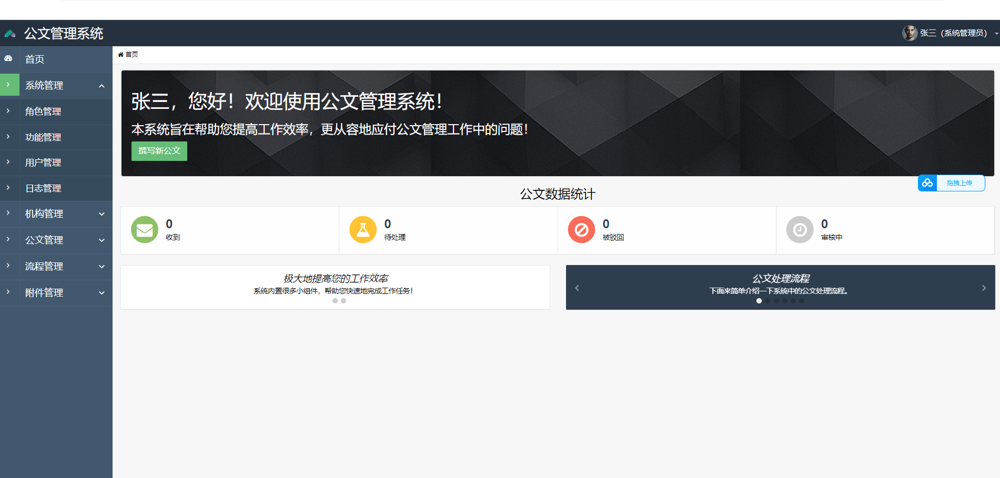
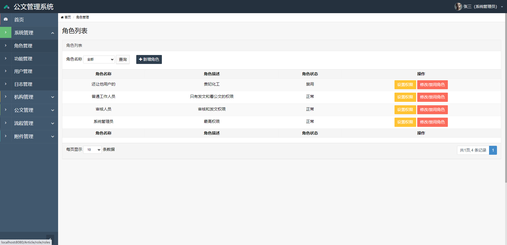
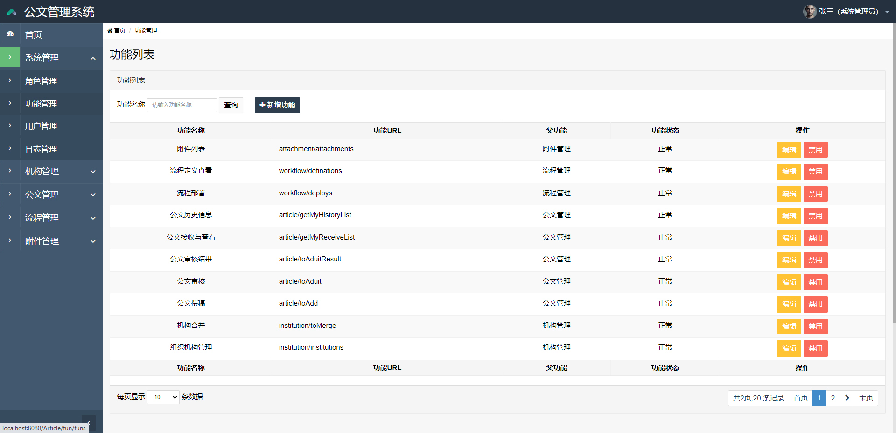
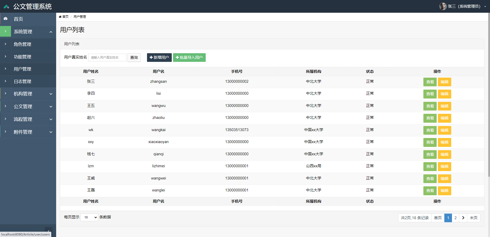
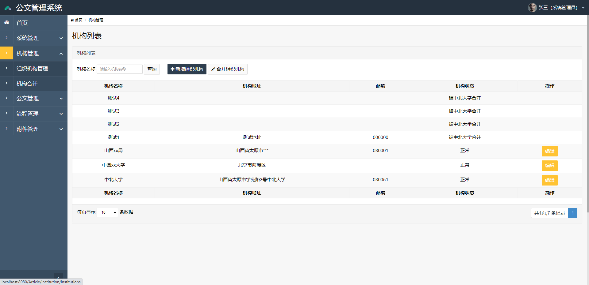
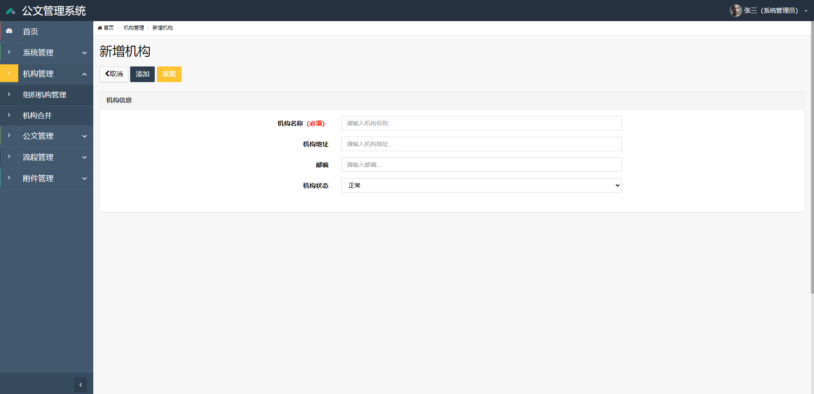
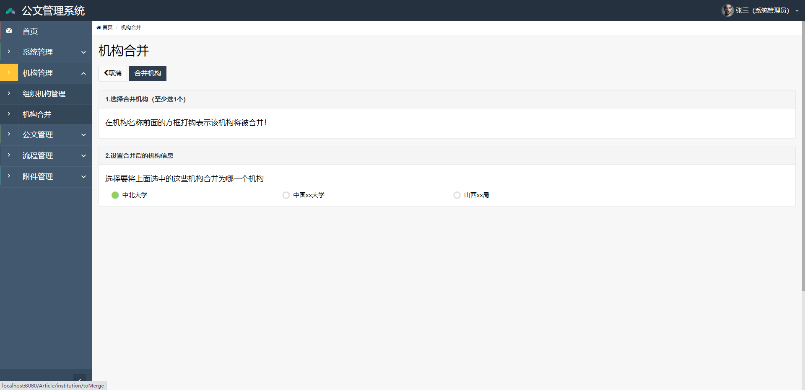
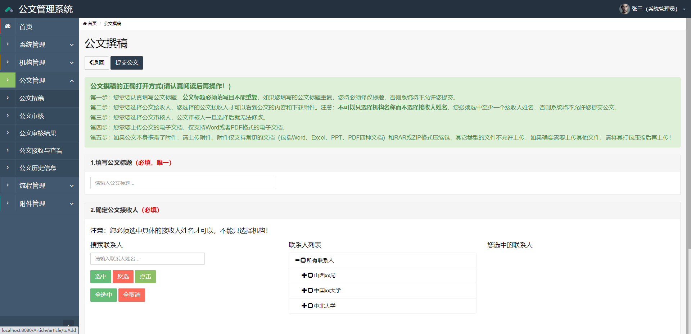
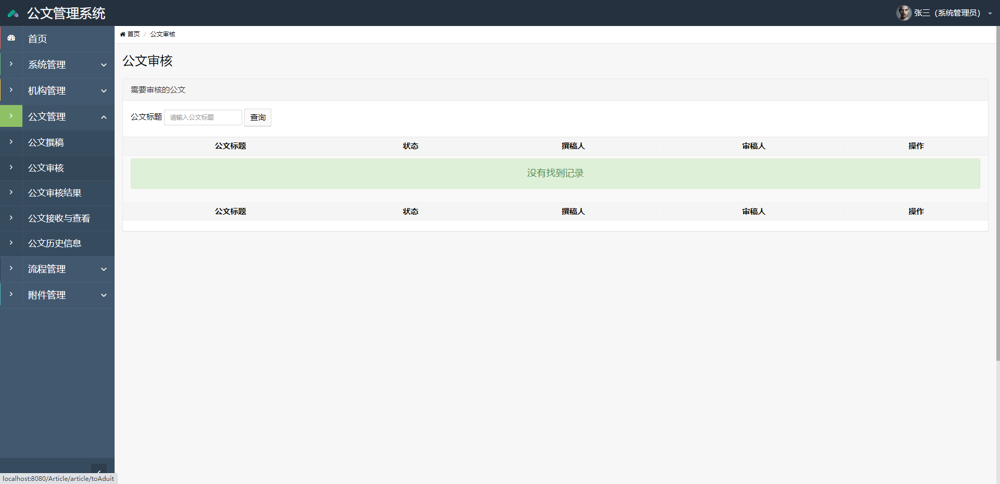
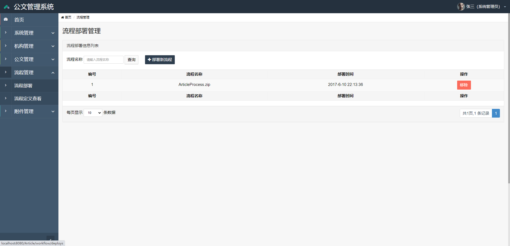

## 基于SSM框架实现的公文管理系统系统

###  获取sql数据库文件: 从戎源码网 (https://armycodes.com/) QQ: 386869957 QQ群: 377586148
###  所有系统地址: (https://github.com/YuLin-Coder/AllProjectCatalog) 
###  所有项目以及源代码本人均调试运行无问题 可支持远程安装部署调试、定制修改、代码讲解

## 项目介绍
基于SSM框架实现的公文管理系统系统，主要功能如下
1) 网站平面设计：
设计精美但是简洁，清爽的网站页面。 
公文管理系统主要是方便机关单位工作人员方便的发送公文，该系统包括：组织机构管理，人员管理，权限管理，公文管理 

2) 系统模块：
系统首先默认一个超级管理员，超级管理人员通过excel导入人员机构信息

机构管理:有权限的用户对机构信息进行增加，编辑，如果机构下面没有人员， 则可以删除，机构合并，可以为该机构分配人员

人员管理:有权限的用户对人员进行基本信息的修改，增加，停用不在岗人员账号

3) 公文管理功能模块：
1 有权限的工作人员进行公文拟稿，附件上传，当用户保存信息，则可以修改，可以删除，但是一旦提交，则不可再修改变动。

2 当公文被提交时，审核流程启动，那么审核功能开启，有权限的人就可以对提交的公文信息进行审核，审核通过则可以发布，打印，审核未通过打回去，又回到1的过程可以编辑再提交，或者直接删除。

## 项目技术
- 编程语言：Java
- 数据库：MySQL
- 前端技术：JSP、JavaScript、bootstrap、JQuery
- 后端技术：Spring、SpringMVC、MyBatis

## 运行环境
- JDK版本：JDK1.8及以上
- 开发工具：IDEA、Ecplise、Myecplise都可以
- 数据库: MySQL5.7及以上
- Maven：maven3.0及以上

## 运行截图

